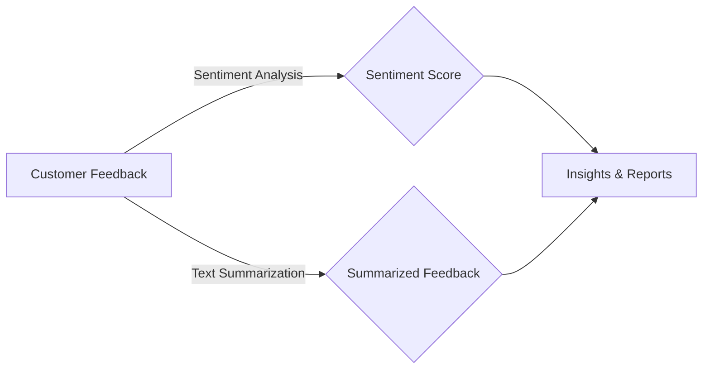

# 📢 Customer Feedback Analysis using Sentiment Analysis & Text Summarization

## 📌 Overview
This project is designed to **analyze customer feedback** using **sentiment analysis** and **text summarization models**. It provides a clear and concise overview of customer sentiments by summarizing feedback into meaningful insights.

### 🏆 Key Objectives:
- Extract **sentiment polarity** (positive, neutral, negative) from customer reviews.
- Generate **summarized insights** from feedback using **AI models**.
- Provide a **holistic view** of customer opinions to improve services.

## 🛠️ Technologies Used
- **Python 3.12.4**
- **Hugging Face Transformers** (BERT, BART, T5)
- **NLTK / Vader / TextBlob** (for sentiment analysis)
- **PyTorch / TensorFlow**
- **Google Colab / Jupyter Notebook** (for development)

## 🚀 Features
- **Sentiment classification**: Detects positive, neutral, or negative sentiment.
- **Text summarization**: Reduces long customer feedback into key points.
- **Automated analysis**: Works on large datasets for quick insights.
- **Customizable**: Adjusts models and parameters for fine-tuning.

## 📥 Installation
To run this project locally, install the required dependencies:
```bash
pip install transformers torch nltk textblob
```

## 📌 Usage
### 1️⃣ Load Sentiment & Summarization Models
```python
from transformers import AutoTokenizer, AutoModelForSeq2SeqLM
from textblob import TextBlob

model_name = "facebook/bart-large-cnn"
tokenizer = AutoTokenizer.from_pretrained(model_name)
model = AutoModelForSeq2SeqLM.from_pretrained(model_name)
```

### 2️⃣ Perform Sentiment Analysis
```python
def analyze_sentiment(text):
    return TextBlob(text).sentiment.polarity

feedback = "The product quality is great, but the delivery was delayed."
sentiment_score = analyze_sentiment(feedback)
print("Sentiment Score:", sentiment_score)
```

### 3️⃣ Summarize Feedback
```python
inputs = tokenizer(feedback, return_tensors="pt", truncation=True, padding="longest")
summary_ids = model.generate(inputs["input_ids"], max_length=50, min_length=10, num_beams=4)
summary = tokenizer.decode(summary_ids[0], skip_special_tokens=True)

print("Summary:", summary)
```

## 🔥 How It Works


## 📜 License
This project is open-source and available under the MIT License.

## ✨ Contributions
Contributions are welcome! Feel free to open issues or submit PRs to enhance functionality.

---
🚀 **Gain customer insights faster & smarter!**

